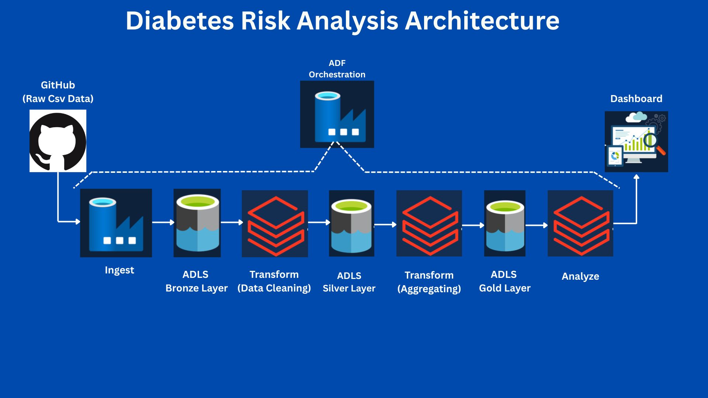
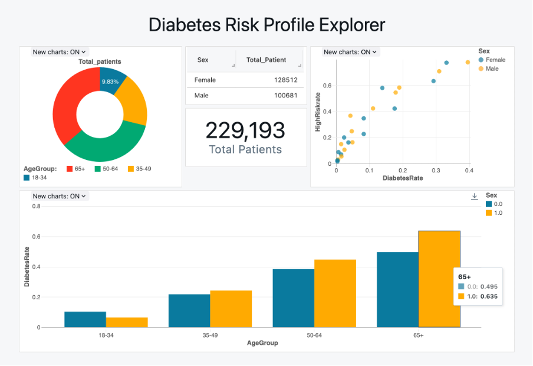
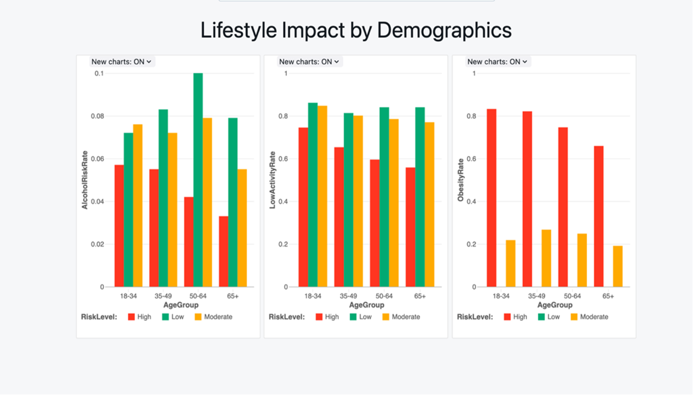

# ETL Diabetes Risk Analysis Pipeline

This project demonstrates a modular and scalable ETL pipeline for analyzing health risks using the BRFSS 2015 dataset. It follows the **Bronze-Silver-Gold** architecture and is powered by **Azure Databricks**, **Azure Data Factory**, and interactive **dashboard visualizations**.

---

## 📁 Project Structure

```
Final-Project/
├── ETL_pipeline_code/
│   ├── bronze_silver.html
│   ├── silver_to_gold.html
│   └── gold_to_dashboard.html
│
├── Data/
│   └── diabetes_binary_health_indicators_BRFSS2015.csv
│
├── docs/
│   ├── Complete_ETL_Pipeline_Documentation.docx
│   ├── Storage_Verification_and_Orchestration.docx
│   ├── Visualization_Report.docx
│   └── Presentation.pdf
│
├── images/
│   ├── Architecture.jpg
│   ├── Dashboard-1.png
│   └── Dashboard-2.png
│
├── README.md
└── .gitignore (optional)
```

---

## 🔁 ETL Workflow

### 🔸 Architecture Diagram



### 🔹 Phase 1: Bronze ➜ Silver  
- Ingest raw CSV using a defined schema  
- Drop nulls and duplicates  
- Output cleaned Parquet files

### 🔹 Phase 2: Silver ➜ Gold  
- Feature engineering: Obese, LowActivity, AlcoholRisk  
- Create composite HighRiskScore  
- Group data by AgeGroup, Sex, and Income

### 🔹 Phase 3: Gold ➜ Dashboard  
- Summarize diabetes risk and lifestyle indicators  
- Prepare final Gold dataset for visual exploration

### 🔄 Orchestration via Azure Data Factory  
- Master pipeline in ADF triggers all three notebooks sequentially  
- Ensures automation and end-to-end lineage

---

## 📊 Dashboards

### 🧩 Diabetes Risk Profile Explorer
This dashboard shows how diabetes rates and health risks vary across age groups and genders.



**Contains:**
- AgeGroup distribution (Pie Chart)
- Total patients by gender (KPI Box)
- DiabetesRate vs HighRiskRate (Scatter)
- DiabetesRate by AgeGroup and Sex (Bar)

---

### 🏃 Lifestyle Impact by Demographics
Compares lifestyle indicators across risk levels and age groups.



**Contains:**
- AlcoholRiskRate by AgeGroup + RiskLevel
- LowActivityRate by demographic
- ObesityRate comparison by risk category

---

## 🛠️ Tools Used

- Azure Databricks (Apache Spark, PySpark)
- Azure Data Factory (ADF Pipelines)
- Power BI / Databricks Dashboards
- GitHub for version control

---

## 📎 Deliverables

- ✅ Modular ETL Notebooks
- ✅ Structured Bronze → Silver → Gold pipeline
- ✅ Dashboard Visualizations
- ✅ ADF Orchestration
- ✅ Complete Documentation and Presentation

---

## 📩 Contact

**Puneeth Kumar Amudala**  
🔗 [LinkedIn](https://www.linkedin.com/in/puneeth-kumar-amudala-4bb7a4245/)
📧 puneethkumaramudala7@gmail.com
